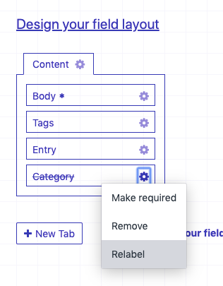
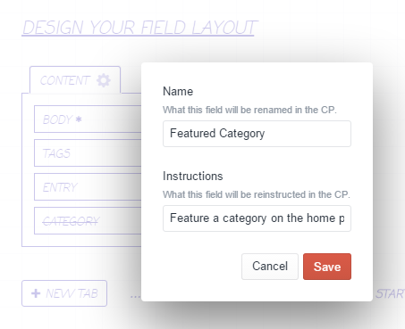

# Field Labels

A Craft CMS plugin that allows overriding field labels and instructions for individual entry and element types in the field layout designer.
This is useful for when you want to tailor the name or instructions of a field to a particular area, without having to
create another (essentially identical) field.

If you want to *hide* a field's name or instructions, rather than replace them -- Field Labels can do that, too!  Just check the Hide Name and/or the Hide Instructions boxes in the Field Labels relabelling modal window.

Field Labels supports overriding the names and instructions on any custom fields used with:
- Craft CMS's in-built sections/entry types, category groups, global sets, users, assets/volumes and tag groups
- Craft Commerce product types, variants, orders and subscriptions
- [Neo](https://github.com/spicywebau/craft-neo) fields
- [Solspace Calendar](https://github.com/solspace/craft3-calendar) events
- [Verbb Wishlist](https://github.com/verbb/wishlist) list types and items
- [Verbb Events](https://github.com/verbb/events)
- [Verbb Gift Voucher](https://github.com/verbb/gift-voucher)

*Note: This is the plugin originally released for Craft 2 as Relabel.*

## Requirements

Field Labels requires Craft CMS 3.1.24 or later.  For Relabel for Craft 2, see the [`craft-2`](https://github.com/spicywebau/craft-fieldlabels/tree/craft-2) branch.

## Installation

Field Labels can be installed from the [Craft Plugin Store](https://plugins.craftcms.com/) or with [Composer](https://packagist.org/).

### Craft Plugin Store
Open your Craft project's control panel, navigate to the Plugin Store, search for Field Labels and click Install.

### Composer
Open your terminal, navigate to your Craft project's root directory and run the following command:
```
composer require spicyweb/craft-fieldlabels
```
Then open your project's control panel, navigate to Settings &rarr; Plugins, find Field Labels and click Install.

### Upgrading from Relabel for Craft 2
When installing Field Labels on a Craft 3 project that was upgraded from Craft 2 and had Relabel for Craft 2 installed, the previous Relabel data will automatically be migrated for use with Field Labels.

## Screenshots




---

*Created by [Benjamin Fleming](https://github.com/benjamminf)*
<br>
*Maintained by [Spicy Web](https://spicyweb.com.au)*
