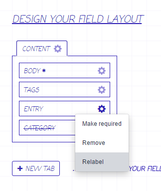

# Relabel for Craft

Allows overriding field labels and instructions for individual entry and element types in the field layout designer.
This is useful for when you want to tailor the name or instructions of a field to a particular area, without having to
create another (essentially identical) field.

## Screenshots

